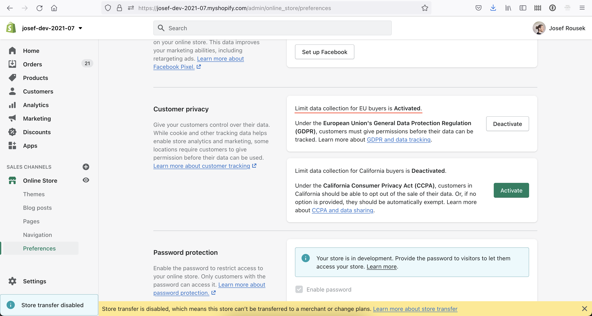

# Shopify cookie banner

Jak přidat cookie lištu do [Dawn](https://themes.shopify.com/themes/dawn/styles/default) šablony.

V `layout/theme.liquid` udělejte následující změny.

1. Složky `assets` a `snippests` zkopírujte do vaší šablony.
2. Před `</body>` přidejte ``.
3. Do `<head>` přidejte `{{ 'cookies.css' | asset_url | stylesheet_tag }}`.

Následně v [nastavení Online store sales channelu](http://shopify.com/admin/online_store/preferences?shpxid=10bc2969-825E-4FF1-0BEC-333A0DEF2FFE) aktivujte “Limit data collection for EU buyers”.

